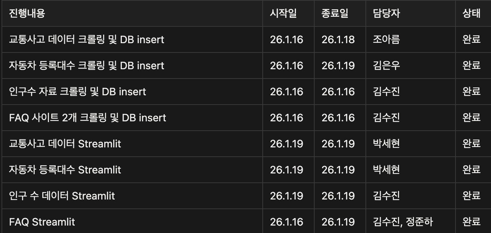
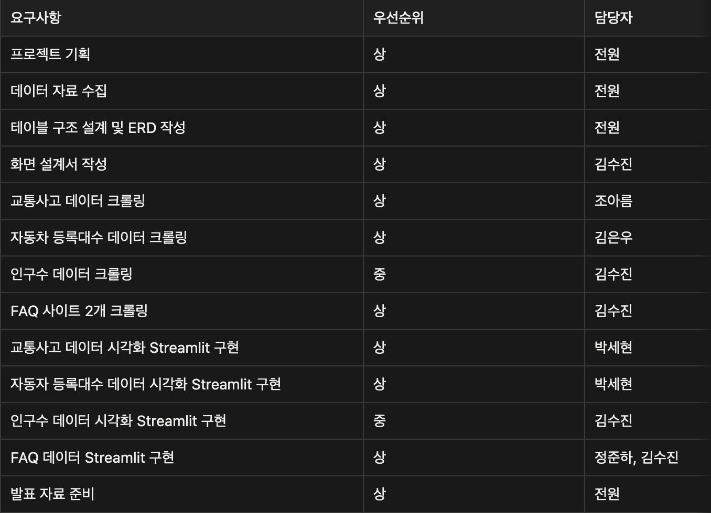
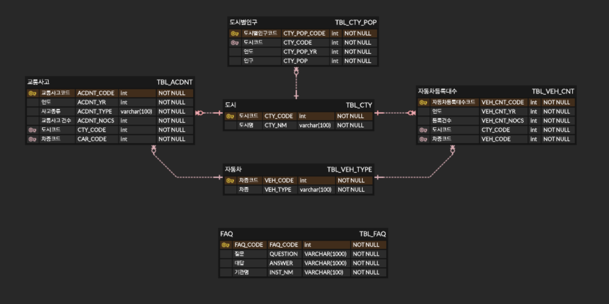
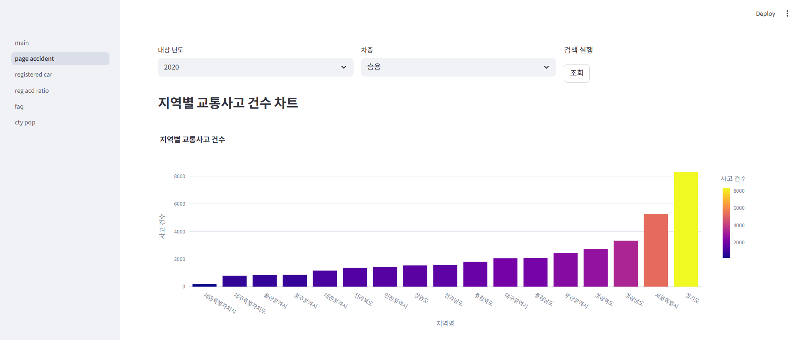
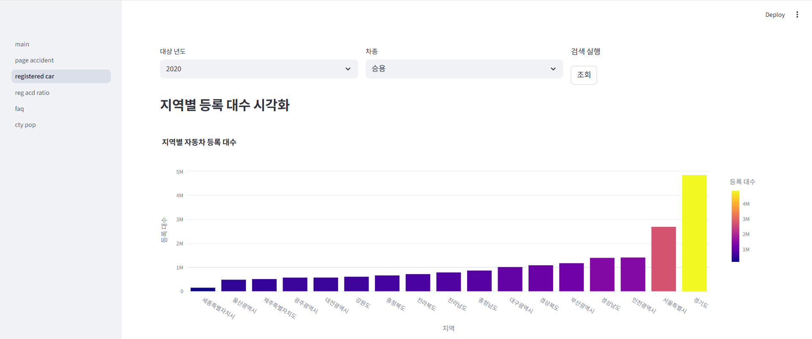
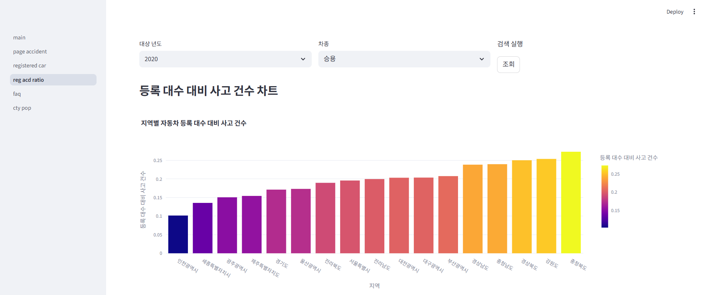
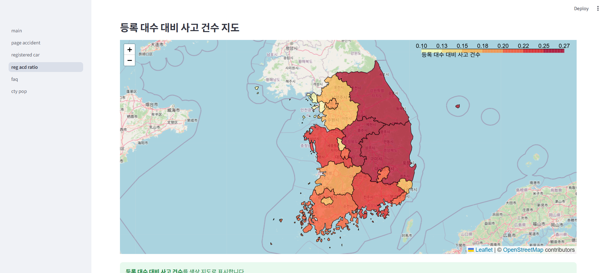
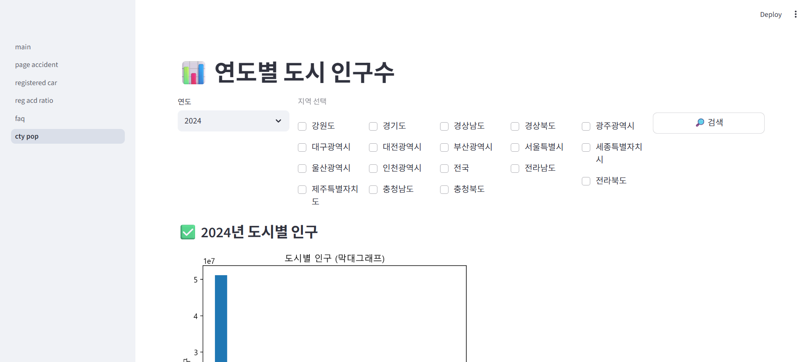
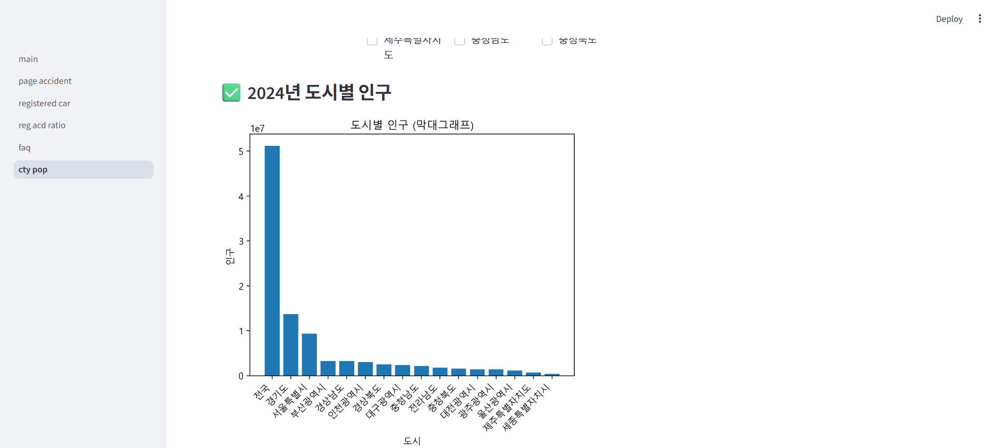
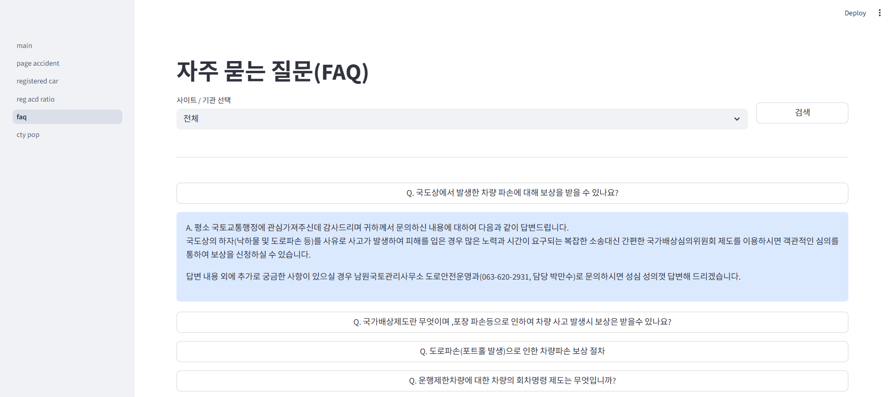

# SKN24-1st-1Team

## 도로지킴이 소개

|  |  |  |  |  |
|:---:|:---:|:---:|:---:|:---:|
| **김수진** | **김은우** | **박세현** | **조아름** | **정준하** |
| ⭐️귀요미⭐️ <br/> 기획/DB설계/BE | DB설계/BE | DB설계/FE/화면설계 | DB설계/BE | 화면설계/FE |
| [](https://github.com/KimSujin02) | [](https://github.com/whitehole17) | [](https://github.com/parksay) | [](https://github.com/areum117) | [](https://github.com/junhaj27-jpg) |


## 프로젝트 개요

### 👷안전지대👷

> 차량 밀집도 대비 사고 다발 구간 분석을 통한 지자체 맞춤형 인프라 최적화 서비스

단순히 사고가 많이 난 곳이 아니라, 통행량(밀집도) 대비 사고율이 비정상적으로 높은 **'위험 사각지대'** 를 찾아내어 지자체가 제한된 예산 내 가장 효과적인 교통 안전 인프라 설치 지점을 선정할 수 있도록 지원하는 솔루션

## 기술 스택

     

국토교통통계누리(교통사고)<br>
https://stat.molit.go.kr/portal/cate/statView.do?hRsId=58&hFormId=5498&hDivEng=&month_yn=<br>
국가통계포털(자동차등록현황)<br>
https://kosis.kr/index/index.do<br>
한국 인구수 통계(인구수)<br>
https://jumin.mois.go.kr/<br>
국토교통부 민원마당(FAQ)<br>
https://eminwon.molit.go.kr/faqList.do<br>
한국교통안전공단(FAQ)<br>
https://main.kotsa.or.kr/portal/bbs/faq_list.do?menuCode=04010100<br>

## WBS



## 파일 구조

```
.
.
├── assets/                         # 이미지 파일 저장용 폴더
│
├── crawling/                       # 크롤러 모듈
│   ├── accident.csv                # 교통사고 통계 데이터
│   ├── accident_csv_processor.py   # 교통사고 데이터 csv 프로세서
│   ├── crawler_tbl_veh_cnt.py      # 전국 차량 등록대수 크롤러
│   ├── crawling_city_pop.py        # 인구수 크롤러
│   ├── crawling_faq1.py            # 국토교통부 민원마당 FAQ 크롤러
│   └── crawling_faq2.py            # 한국교통안전공단 FAQ 크롤러
│
├── sql/                            # DB 관련 모듈
│   ├── city_pop_sql.py
│   ├── faq_sql.py
│   └── roadkeeper.sql              # DB 스키마
│
├── streamlit/                      # streamlit 코드 폴더
│   ├── common.py                   # 화면 공통 모듈
│   ├── main.py                     # 메인 페이지
│   └── /pages                      # 페이지 리스트
│       ├── 01_page_accident.py     # 지역별 사고 건수
│       ├── 02_registered_car.py    # 지역별 자동차 등록 대수
│       ├── 03_reg_acd_ratio.py     # 지역별 자동차 등록 대수 대비 사고 건수
│       ├── 04_faq.py               # faq 페이지
│       └── 05_cty_pop.py           # 인구 수 페이지
│
├── .gitignore                  # Git 제외 파일 설정
└── README.md                   # 프로젝트 개요 및 사용 방법
```

## 요구사항 명세서



## ERD



## 수행결과


<video controls>
  <source src="./assets/roadkeeper_short.mov" type="video/mp4">
</video>

<hr/>
<br/>









## 추가 발전 방향

- 현재는 연도, 지역, 차종별로 자동차등록대수 대비 교통사고 건수를 확인하였지만 한국도로교통공단의 교통사고분석시스템에 있는 월별, 요일별, 시간대별, 주야별, 일별, 사고유형별 등으로 구분하여 확인할 수 있습니다.
- [**인구 10만명당 교통사고율**](https://www.google.com/search?q=%EC%9D%B8%EA%B5%AC+10%EB%A7%8C%EB%AA%85%EB%8B%B9+%EA%B5%90%ED%86%B5%EC%82%AC%EA%B3%A0%EC%9C%A8&client=safari&hs=taWU&sca_esv=c03ec876592c9bde&rls=en&sxsrf=ANbL-n7Fimdz7w9Tv-mV9cVjKlLfnRM9Bg%3A1768799959605&ei=175taZLVJJ3g2roPx52ogQI&ved=2ahUKEwiDjr-v7ZaSAxWHklYBHU6LNX0QgK4QegQIAxAD&uact=5&oq=%EC%9E%90%EB%8F%99%EC%B0%A8%EB%93%B1%EB%A1%9D%EB%8C%80%EC%88%98+%EB%8C%80%EB%B9%84+%EA%B5%90%ED%86%B5%EC%82%AC%EA%B3%A0+%ED%86%B5%EA%B3%84+%EB%B6%84%EC%84%9D&gs_lp=Egxnd3Mtd2l6LXNlcnAiN-yekOuPmeywqOuTseuhneuMgOyImCDrjIDruYQg6rWQ7Ya17IKs6rOgIO2GteqzhCDrtoTshJ0yBRAhGKABMgUQIRigAUiUFlCoB1iGFnAJeACQAQKYAbQBoAGJD6oBBDIuMTS4AQPIAQD4AQGYAg-gApUFwgIKEAAYsAMY1gQYR8ICBBAjGCfCAgUQABjvBcICCBAAGIAEGKIEwgIHECEYoAEYCpgDAIgGAZAGCpIHBDExLjSgB4pAsgcDMi40uAfSBMIHCDAuNC4xMC4xyAc-gAgA&sclient=gws-wiz-serp): 특정 지역의 인구 규모 대비 사고 발생 정도를 파악하여 사회적 위험도를 측정합니다.
- [**교통사고 치명률**](https://www.google.com/search?q=%EA%B5%90%ED%86%B5%EC%82%AC%EA%B3%A0+%EC%B9%98%EB%AA%85%EB%A5%A0&client=safari&hs=taWU&sca_esv=c03ec876592c9bde&rls=en&sxsrf=ANbL-n7Fimdz7w9Tv-mV9cVjKlLfnRM9Bg%3A1768799959605&ei=175taZLVJJ3g2roPx52ogQI&ved=2ahUKEwiDjr-v7ZaSAxWHklYBHU6LNX0QgK4QegQIAxAF&uact=5&oq=%EC%9E%90%EB%8F%99%EC%B0%A8%EB%93%B1%EB%A1%9D%EB%8C%80%EC%88%98+%EB%8C%80%EB%B9%84+%EA%B5%90%ED%86%B5%EC%82%AC%EA%B3%A0+%ED%86%B5%EA%B3%84+%EB%B6%84%EC%84%9D&gs_lp=Egxnd3Mtd2l6LXNlcnAiN-yekOuPmeywqOuTseuhneuMgOyImCDrjIDruYQg6rWQ7Ya17IKs6rOgIO2GteqzhCDrtoTshJ0yBRAhGKABMgUQIRigAUiUFlCoB1iGFnAJeACQAQKYAbQBoAGJD6oBBDIuMTS4AQPIAQD4AQGYAg-gApUFwgIKEAAYsAMY1gQYR8ICBBAjGCfCAgUQABjvBcICCBAAGIAEGKIEwgIHECEYoAEYCpgDAIgGAZAGCpIHBDExLjSgB4pAsgcDMi40uAfSBMIHCDAuNC4xMC4xyAc-gAgA&sclient=gws-wiz-serp): 사고 발생 건수 대비 사망자 비율로, 사고의 심각성을 나타내며 연령별, 차종별로 차이가 큽니다.

## 한 줄 회고

- **김수진** : 일정이 주어졌을 때 그 기간동안 아이디어를 어떻게 구체화하고 개발할지 고민하는 법을 배울 수 있었습니다. 다른 팀원분들과 데이터의 구조와 수집할 수 있는 방법을 의논하며 협업의 중요성을 체감했습니다. 파이썬이라는 언어에 익숙하지 않았는데 이번 프로젝트를 통해 selenium, requests, Beautiful Soup, pandas 등 여러 가지 모듈을 사용하며 파이썬 기반 데이터 처리와 시각화의 흐름을 이해할 수 있어서 좋았습니다. 제한된 시간 안에서 우선순위를 정하고 구현하는 경험으로 이후 프로젝트를 진행하는 데 큰 도움이 될 거 같습니다.

- **김은우** : 개발 협업을 처음 진행하면서 git 을 처음으로 제대로 써보고 DB 환경 구축 등을 진행하였는데 생각했던것과 달리 크롤링 코드를 짜거나 데이터를 처리하는 과정보다 초기환경 구축과 큰 틀을 짜는게 더 어려웠고 중요하다는 것을 체감하였습니다. 그래도 좋은 팀원분들 덕분에 빠르게 방향을 설정할 수 있었습니다. 맡은 부분 코드를 작성하고 거의 엎으면서 python 라이브러리 활용과 SQL에 대해 더 자세히 이해하게 됐습니다.

- **박세현** : 팀원끼리 모여서 하나의 서비스를 구상하고 직접 구현해보는 과정에서 많은 걸 배울 수 있었습니다. 그동안 가장 효율적인 설계가 정답이라고 생각해왔지만 이번 프로젝트를 통해 설계에서 정답은 없다는 점을 깨닫게 됐습니다. 설계 단계에서 단지 우리 서비스에 가장 적합한 기술과 상태를 찾으면 된다는 점을 체감했습니다. 또한 구현 과정에서 웹상에 게시된 데이터를 수집하였고, 수집한 데이터를 가공하여 시각화해봤습니다. 이 과정에서 크롤링이 동작하는 기본적인 개념을 익혔고 차트나 지도 등을 그리는 법을 익혔습니다. 짧은 시간 안에 많은 내용을 완수하려면 작업을 목록으로 만들고 우선순위에 따라 시간 안배를 적절하게 해야 한다는 점을 느꼈습니다.

- **조아름** : 기획부터 DB 설계, 데이터 수집까지 기간 안에 이 모든 것을 다 할 수 있을까 걱정이 많았었는데 팀원들과의 많은 소통으로 빠른 속도로 프로젝트를 진행할 수 있었습니다. 처음에는 Selenium이나 BeautifulSoup을 활용한 웹 크롤링 경험을 쌓을 수 있을 것이라 기대했지만, 대상 사이트의 복잡한 엘리먼트 구조로 인해 엑셀 데이터 가공 방식으로 방향을 전환하게 되어 아쉬움이 남았고, 다음에는 실제 웹 크롤링 경험을 충분히 쌓아보고 싶습니다. 

- **정준하** : 이번 프로젝트에서는 제가 맡은 작업뿐 아니라 전체 서비스가 완성되는 흐름을 이해하는 데 집중했습니다. 특히 초기 기획과 데이터 구조가 이후 모든 단계에 영향을 준다는 점을 배웠고, 다음 프로젝트에서는 초반 이해와 소통에 더 적극적으로 참여하고 싶습니다.
